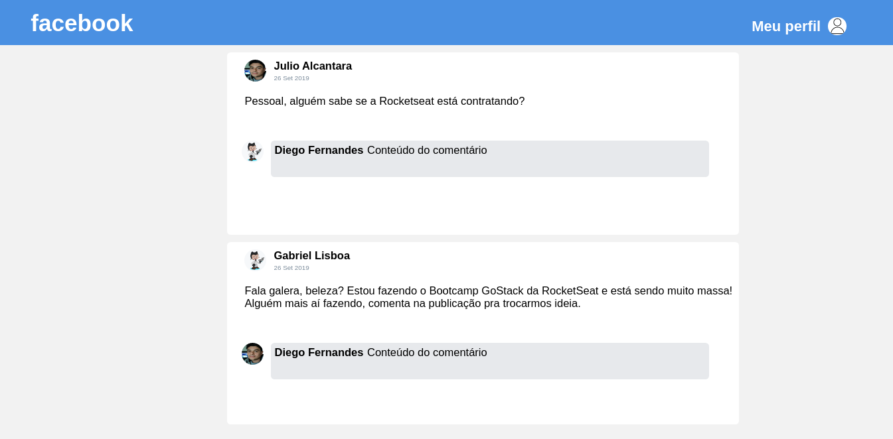

# feed-face

:boy: :blue_book: an interface inspired by the facebook news feed

---

<h1 align="center">
    
</h1>

<h3 align="center">
  Desafio 4: Introdução ao React
</h3>

## :rocket: Sobre o desafio

Criar uma aplicação do zero utilizando **Webpack, Babel, Webpack Dev Server e ReactJS**.

Nessa foi desenvolvido uma **interface** semelhante com a do **Facebook** utilizando React.

As informações contidas na interface são **estáticas**.

### Tela da aplicação

